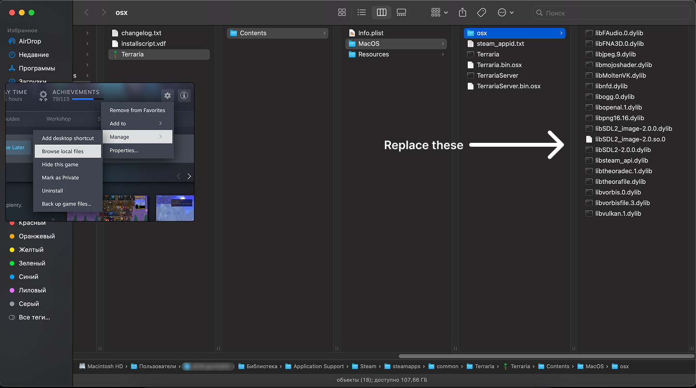

# Terraria Lags and Memory Leak Fix

1. Open the game properties in Steam.  
2. Enter `/gldevice:Vulkan` in the launch options.  
3. Move the files in the "osx" folder as shown in the picture.
  
5. Enjoy the game!
